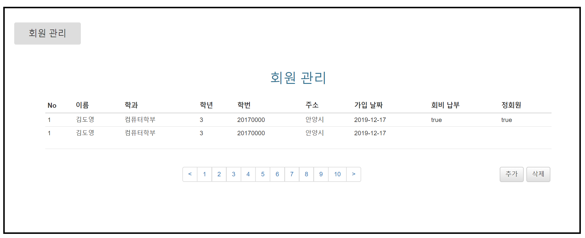

# manage to coupon webpage
>3학년 겨울방학에 진행하는 개인 프로젝트 

## project purpose
동아리 회원 정보를 입력받으면 DB에 저장하는 프로젝트
- 회원 정보 CRUD (진행 중)
- REST API json 파일로 문서화
- password 암호화 (Spring Security)

## develop environment
### JDK (Java Development Kit)
- Java 1.8.x

### Server (Controller)
- Spring Boot

### Database (Model)
- MySQL
- Lombok plugin
- JPA

### Front-End (View)
- html
- CSS (bootstrap)
- javascript

##### manageMember.html

## Dependency
|dependency|Version|
|:------:|:---:|
|**Server**|---------------------|
|SpringBoot|2.2.2 RELEASE|
|**TEST**|---------------------|
|junit||
|**Database**|---------------------|
|JPA|1.0.0.Final|
|MariaDB|2.5.2|

 [의존성 참고](https://mvnrepository.com/)
## API Specification
[]

## todolist
- [x] mamagemember.html bootstrap, css 이용하여 디자인
- [ ] Database 테이블 설계
- [ ] 데이터 흐름 설계
- [ ] REST API JSON 파일로 파싱하는 방법 공부
- [ ] 웹 어플리케이션 확장 기능 생각해보기 ex) 로그인 기능